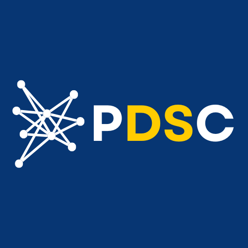

# Welcome to the Pace Data Science Club Github!

## Club Description

-We are an organization dedicated to exploring the applications of data science in a variety of practical and academic spaces.
-With more than 250 members, we are a large and diverse organization, with a focus on collaboration and developing technical proficiencies among our members.

## Announcements

-Look out for Hackathon signups and scheduled workshop updates, coming soon!
